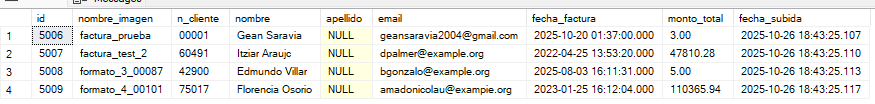
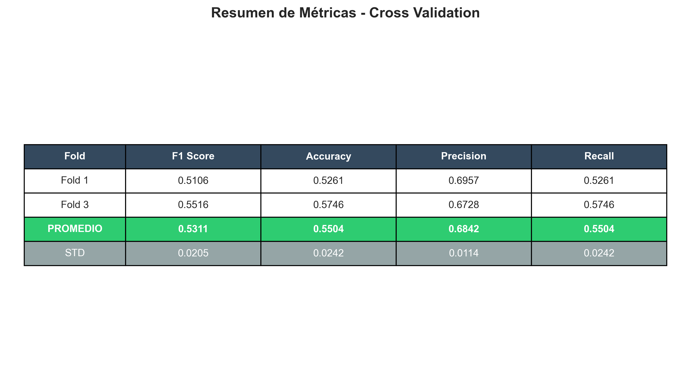

# Sistema de Extracción Automática de Datos de Facturas con LayoutLMv3

## Descripción

Este proyecto implementa un pipeline completo end-to-end para:
- Generar facturas sintéticas en múltiples formatos
- Entrenar un modelo LayoutLMv3 para reconocimiento de documentos
- Extraer automáticamente campos clave (nombre, email, fecha, monto, etc.)
- Almacenar resultados en SQL Server
- Consultar datos mediante interfaz con ChatGPT

## Características Principales

- **5 formatos de facturas diferentes** para variabilidad del modelo
- **LayoutLMv3** pre-entrenado con transfer learning
- **PaddleOCR** para detección de texto
- **Validación cruzada** con 5 folds
- **Integración con SQL Server** para el almacenamiento de datos extraidos de las facturas
- **Chat** con OpenAI GPT para consultas en lenguaje natural
- **F1 Score: 55%** | **Accuracy: 57%**

## Tecnologías Utilizadas:
| Categoría | Tecnologías |
|-----------|-------------|
| **IA/ML** | LayoutLMv3, PaddleOCR, PyTorch, Hugging Face Transformers |
| **Generación de datos** | Faker, Jinja2, WeasyPrint |
| **Base de datos** | SQL Server (LocalDB) |
| **Backend** | Python, Flask |
| **Procesamiento** | OpenCV, PIL, NumPy |
| **APIs** | OpenAI GPT-4 |
| **Otros** | scikit-learn, python-dotenv |

## Arquitectura del Sistema

┌──────────────────────────────────────────────────────────────┐
│                    FASE 1: GENERACIÓN DE DATOS               │
├──────────────────────────────────────────────────────────────┤
│  generate_pdfs.py → 10,000 facturas (PDF + PNG + JSON)       │
│  separacion.py → Split 80/20 (train/test)                    │
│  preprocesar_ocr.py → PaddleOCR + etiquetado con keywords    │
│  crear_carpetas.py → 5 folds para validación cruzada         │
│  conversion_a_layoutlmv3.py → Formato Hugging Face Datasets  │
└──────────────────────────────────────────────────────────────┘
                              ↓
┌─────────────────────────────────────────────────────────────────┐
│                    FASE 2: ENTRENAMIENTO                        │
├─────────────────────────────────────────────────────────────────┤
│  entrenar_layoutlmv3_cruzado.py                                 │
│  - Transfer learning desde microsoft/layoutlmv3-base            │
│  - 4 epochs por fold                                            │
│  - Todas las capas entrenan (sin congelamiento)                 │
│  - Batch size: 6 | Learning rate: 5e-5                          │
│  → Genera: modelo_fold_X + métricas                             │
└─────────────────────────────────────────────────────────────────┘
                              ↓
┌─────────────────────────────────────────────────────────────────┐
│                    FASE 3: PRODUCCIÓN                           │
├─────────────────────────────────────────────────────────────────┤
│  procesar_factura.py (Orquestador)                              │
│  ├─→ evaluar_modelo.py → Procesa facturas nuevas                │
│  ├─→ cargar_datos.py → Carga a SQL Server                       │
│  └─→ app_web.py → Interfaz Flask + Chat con OpenAI              │
└─────────────────────────────────────────────────────────────────┘

### Requisitos

- Python 3.8+
- CUDA 11.8+ (opcional, para GPU NVIDIA)
- SQL Server LocalDB
- ~10GB espacio en disco

## Resultados del Entrenamiento

### Configuración del Modelo

El modelo fue entrenado con las siguientes especificaciones:

| Parámetro | Valor |
|-----------|-------|
| **Modelo base** | microsoft/layoutlmv3-base |
| **Epochs** | 1 al principio, 4 en el reentrenamiento |
| **Batch Size** | 6 |
| **Learning Rate** | 5e-5 |
| **Capas congeladas** | Al principio se congelaron 10 capas para acelerar el proceso, en el reentrenamiento ninguna (todas entrenan) |
| **Hardware** | NVIDIA RTX 2060 (6GB VRAM) |
| **Tiempo de entrenamiento** | ~7 horas por fold |

### Métricas de Validación Cruzada

**Comparación Fold 1 vs Fold 3:** (con 4 epochs)

| Métrica | Fold 1 (capas congeladas) | Fold 3 (capas descongeladas) | Mejora |
|---------|---------------------------|------------------------------|--------|
| **F1 Score** | 0.5106 (51%) | **0.5516 (55%)** | +4.1% |
| **Accuracy** | 0.5261 (53%) | **0.5746 (57%)** | +4.9% |
| **Precision** | 0.6957 (70%) | 0.6728 (67%) | -2.3% |
| **Recall** | 0.5261 (53%) | **0.5746 (57%)** | +4.9% |

**Promedio de 2 folds completados:**
- **F1 promedio:** 0.5311 (53%)
- **Accuracy promedio:** 0.5504 (55%)

### ✅ Validación en Producción

El modelo demostró capacidad práctica para extraer información de facturas reales:

**Campos extraídos correctamente:**
- **Nombres:** Alta precisión (ej: "Gean Saravia", "Itziar Araujo")
- **N° Cliente:** 100% de detección (ej: 00001, 60491, 75017)
- **Email:** 100% de detección con formato correcto
- **Fecha de factura:** Formato yyyy-mm-dd correcto
- **Monto total:** Detección normal, pero necesita mayor optimizacion (Actualmente solo reconoce en algunos casos y si hay muchos valores "no llega a reconocer del todo el monto TOTAL")
- **Apellidos:** Requiere optimización (actualmente con valores NULL en algunos casos)
- ***Esto teniendo en cuenta que fueron post-procesados con validaciones antes de generar el json para la carga de datos***

### Análisis de Rendimiento

**Fortalezas del modelo:**
- Detección robusta de campos numéricos (IDs, monto(con dificultad))
- Reconocimiento confiable de emails (teniendo en cuenta el post-procesamiento)
- Extracción precisa de fechas
- Funciona con múltiples formatos visuales (5 formatos diferentes)

**Áreas de mejora:**
- Separación nombre/apellido requiere post-procesamiento
- Datos sintéticos limitan generalización a facturas reales
- Mas restriccion al momento de la carga de datos
- Mejorar la web para que sea mas intuitiva

### Explicacion sobre las Métricas

**Por qué F1: 55% (y no 80%+):**

1. **Keywords permisivas en etiquetado:**
   - Ejemplo: "N° Cliente: 78818" genera 3 etiquetas `n_cliente` en lugar de 1
   - Resultado: 35,531 etiquetas `n_cliente` contra las ~8,000 esperadas
   - Impacto: Ruido en datos de entrenamiento al ser muchas

2. **Datos sintéticos:**
   - Facturas generadas automáticamente carecen de variabilidad como una factura real

3. **4 epochs:**
   - Suficiente para aprendizaje básico, principalmente cuando se entreno con 1 epoch este guardaba "errores" al momento de detectar el nombre, podria confundirse el nombre con lo que decia el logo de la factura, con 4 epochs si bien se mejoro para obtener una mejor precision, mejoro la deteccion de los nombres pero demostro datos "bajos" como por ejemplo los montos.
   Se necesita reentrenar con 6 epochs y sin las capas congeladas.
   ¿Porque esto no se hizo?
   Debido al tiempo que demanda tener el script de entrenamiento corriendo, con 4 epochs y sin capas congeladas en mi equipo tardó aproximadamente 8-9 horas sin poder usar otro programa.
   El resultado fue una mejora del 4% frente a cuando entrenamos con 4 epochs y capas congeladas.
   - Más epochs mejorarían pero con riesgo de overfitting, si pasamos de 4 a 10 este mismo podria generar una memorizacion de nuestro modelo y no terminaría de aprender.

##  Mejoras Futuras

### 1. Optimización del Modelo

#### Proyección con 6 Epochs

Basándonos en el aprendizaje observado, se puede estimar que un re-entrenamiento con:
- **6 epochs** (sin sobreajuste)
- **Todas las capas descongeladas**
- **Keywords más estrictas** (reducir ruido en datos)

Proyectaría mejoras en:
- **F1 Score:** actual 55%
- **Accuracy:** actual 57%

**Justificación técnica:**
- El modelo mostró mejora consistente al descongelar capas (+4.9% en accuracy)
- Con más epochs, el modelo aprende patrones más complejos sin memorizar
- Las keywords estrictas reducirá los falsos positivos

### 2. Aplicación Web en Desarrollo

Se planea desarrollar una **aplicación web pública** para que cualquier usuario pueda acceder al modelo:

#### Características Planificadas

**Uso del Sistema:**

Usuario sube PDF → Conversión PDF→PNG automática → OCR + LayoutLMv3 
→ Extracción de campos → SQL Server → Visualización de resultados

**Funcionalidades principales:**
- **Carga masiva de PDFs:** Procesamiento por mayor cantidad
- **Conversión automática:** Script que convierte PDF → PNG en tiempo real
- **Procesamiento instantáneo:** Extracción de datos en 3-5 segundos por factura
- **Almacenamiento persistente:** Base de datos SQL Server con historial
- **Exportación:** Descarga de resultados en CSV/Excel de los pdfs adjuntados

**Tiempo estimado de procesamiento:** 3-5 segundos por factura

**Cómo usar:**
### 1. Generar facturas sintéticas (10,000 PDFs)
python src/generate_pdfs.py

### 2. Separar páginas individuales
python src/separacion.py

### 3. Procesar con OCR y generar anotaciones
python src/preprocesar_ocr.py

### 4. Verificar distribución de etiquetas (opcional)
python src/contar_etiquetas.py

### 5. Dividir en 5 folds para validación cruzada
python src/crear_carpetas.py

### 6. Convertir a formato LayoutLMv3
python src/conversion_a_layoutlmv3.py

## FASE 2: ENTRENAMIENTO
python src/entrenar_layoutlmv3_cruzado.py

## FASE 3: PRODUCCIÓN (Agregar imagenes de facturas en la carpeta test)
#### python src/procesar_factura.py
#### Este mismo si su tabla local y sus datos configurados en el env estan correctos, lo que hará será ejecutar:
#### evaluar_modelo.py (genera json con los resultados de las imagenes)
#### cargar_datos.py (cargara los json generados por el sistema a la bd local)
#### app_web.py (Inicia la interaccion)
